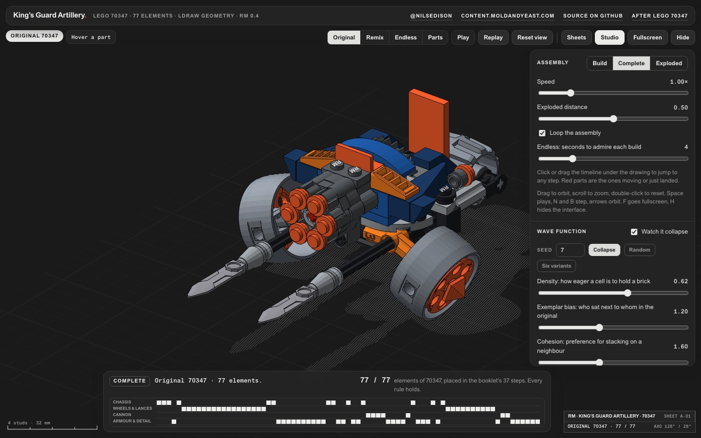

# King's Guard Artillery 70347

**Live: https://70347.moldandyeast.com**

[](https://70347.moldandyeast.com)

The 77 vehicle elements of LEGO set 70347, King's Guard Artillery, placed step by step from the official
building instructions and drawn from real part geometry. Then a wave function collapse gets the same bag of
parts and builds other vehicles. Every joint it makes has to be one the booklet makes, and every build must
pass a check for overlaps, forced studs and parts that couldn't actually be put in.

- **Original** replays the booklet's 37 steps.
- **Remix** collapses a new vehicle from a seed.
- **Endless** keeps building one vehicle after another.
- **Parts** lays the whole bag out as a tray.
- **Instructions** makes a step-by-step booklet for whatever is on the stage, remixes included, and prints it or saves it as a PDF.

The drawing fills the window and the interface floats over it. Drag to orbit, scroll to zoom, double-click to
reset. Space plays, N and B step, arrows orbit, F goes fullscreen, H hides the interface.

## The file

The whole piece is one self-contained file, `public/index.html`: markup, styles, part meshes, solver, renderer
and fonts. It makes no third-party requests and runs offline when saved to disk.

## Publishing

The site is a Cloudflare assets-only Worker on a custom domain. Deploy is manual; pushing a branch publishes
nothing.

```sh
npx wrangler deploy
```

`wrangler.jsonc` points the Worker `70347` at `./public` and at the route `70347.moldandyeast.com`. Work
happens on `70347-github-deploy`; `main` stays near-empty by convention.

## Credits

- Made by [@nilsedison](https://twitter.com/nilsedison) · [content.moldandyeast.com](https://content.moldandyeast.com)
- After [LEGO 70347 King's Guard Artillery](https://www.lego.com/en-us/service/building-instructions/70347),
  building instructions booklet 6187669.
- Part geometry converted from the [LDraw Parts Library](https://www.ldraw.org), licensed CC BY 2.0 / CC BY 4.0.
  Part authors are credited in the library files.
- Wave function collapse after Maxim Gumin, 2016.
- Set in ABC Areal and ABC Areal Mono by [Dinamo](https://abcdinamo.com/typefaces/areal); see
  [`licenses/ABC-Areal-LICENCE.md`](licenses/ABC-Areal-LICENCE.md).

LEGO®, NEXO KNIGHTS™ and the set name belong to the LEGO Group, which does not sponsor or endorse this
project. No logos are used.
